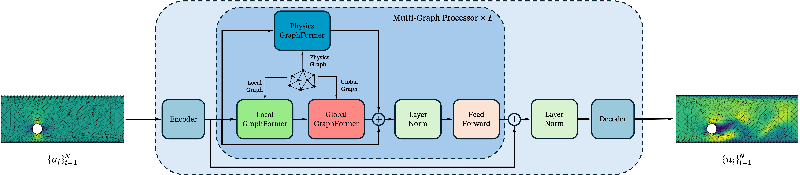

# Harnessing Scale and Physics: A Multi-Graph Neural Operator Framework for PDEs on Arbitrary Geometries

[](https://arxiv.org/abs/2411.15178)
[](https://kdd.org/kdd2025/)
[](https://opensource.org/licenses/MIT)

This repository is an official PyTorch Implementation for "[Harnessing Scale and Physics: A Multi-Graph Neural Operator
Framework for PDEs on Arbitrary Geometries](https://arxiv.org/abs/2411.15178)". [KDD 2025]



## Requirements
To install requirements:

```setup
pip install -r requirements.txt
```

## Datastes

You can download the datasets and preprocessed data from [Google Drive](https://drive.google.com/drive/folders/1Tm15dbYOJVBlrJz3x578gt1QlWKF9YAl?usp=drive_link).

The datasets include:

- Navier-Stokes Equation from [FNO Datasets](https://drive.google.com/drive/folders/1UnbQh2WWc6knEHbLn-ZaXrKUZhp7pjt-);
- Airfoil Time and Deforming Plate from [MeshGraphNets Datasets](https://github.com/google-deepmind/deepmind-research/tree/master/meshgraphnets);
- CarCFD from [ShapeNet](https://shapenet.org/);
- Climate Data from [ECMWF Climate Data Store](https://cds.climate.copernicus.eu/);
- Possion Equation and Cylinder Flow created by ourselves.

## Usage

### Training

1. Add dataset path in the config file in the `configs` folder.

2. Run the following command to train the model:

```train
python train.py --config configs/airfoil_time/grapher.yaml
```

We provide `GNOT`, `U-Net` and `MLP` models as baselines. You can add more models and datasets by following the instructions below.

### Code Structure

The codebase is organized as follows:

- `datasets/`: contains the dataset classes.
- `models/`: contains the model classes.
- `trainers/`: contrains the model builder and dataset procedure classes:
    - `builder/`: contains the model builder classes.
    - `procedure/`: contains the dataset procedure classes.
- `configs/`: contains the configuration files.
- `utils/`: contains the utility functions.
- `main.py`: the main file to run the code.

### Model

Write your model in `models` folder and register it in `models/__init__.py` file. 

```python
from .your_model import YourModel

ALL_MODELS = {
    ...
    'your_model': YourModel,
}
```

### Dataset

Write your dataset in directory `datasets/` and register your dataset in `datasets/__init__.py` as follows:

```python
from .your_dataset import YourDataset
```

### Trainer

Write your model builder in `trainers/builder/` and register it in `trainers/builder/__init__.py` as follows:

```python
from .your_model import YourModelTrainer

TRAINER_DICT = {
    ...
    'your_model': YourModelTrainer,
}
```

We provide two default trainers in `trainers/builder/base.py` which can be used for training the model.

### Procedure

Write your dataset procedure in `trainers/procedure/` and register it in `trainers/procedure/__init__.py` as follows:

```python
from .your_dataset import YourDatasetProcedure
```

Add your dataset procedure in the `main.py` file.

```python
...
elif args.dataset == 'your_dataset':
    procedure = YourDatasetProcedure
...
```

### Config
Write your config in directory `configs/` and run the following command to train the model:

```train
python main.py --config configs/your_config.yaml
```

## Citation
If you find this repository useful in your research, please consider citing the following paper:

```
@article{li2024harnessing,
  title={Harnessing Scale and Physics: A Multi-Graph Neural Operator Framework for PDEs on Arbitrary Geometries},
  author={Zhihao Li, Haoze Song, Di Xiao, Zhilu Lai and Wei Wang},
  journal={arXiv preprint arXiv:2411.15178},
  year={2024}
}
```

## Acknowledgements
This codebase is built from [NeuralFramework](https://github.com/lizhihao2022/NerualFramework).

We appreciate the authors of the following repositories for their contributions to the community:

- [meshgraphnets](https://github.com/google-deepmind/deepmind-research/tree/master/meshgraphnets)
- [neuraloperator](https://github.com/neuraloperator/neuraloperator)
- [Geo-FNO](https://github.com/neuraloperator/Geo-FNO)
- [GNOT](https://github.com/HaoZhongkai/GNOT)
- [Transolver](https://github.com/thuml/Transolver/tree/main)